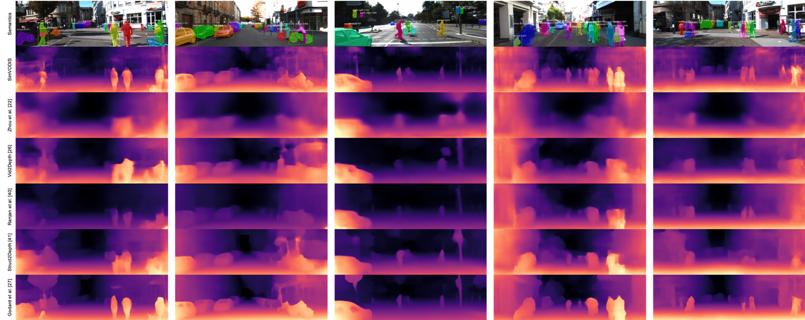

# SimVODIS
[Simultaneous Visual Odometry, Object Detection, and Instance Segmentation.](https://arxiv.org/abs/1911.05939)
SimVODIS extracts both semantic and physical attributes from a sequence of image frames. SimVODIS evaluates the relative pose between frames, while detecting objects and segementing the object boundaries. During the process, depth can be optionally estimated.


You can download the predicted results for the Eigen split from [here](https://drive.google.com/file/d/1K0DBtcL38TtnB29RdcOr3eOG4QAeHfS5/view?usp=sharing).

## Getting Started

These instructions will get you a copy of the project up and running on your local machine for development and testing purposes.

### Requirements

* Ubuntu 16.04+
* CUDA >= 9.0
* Python 3.6+
* [Pytorch 1.0.0 from a nightly release](https://pytorch.org/get-started/previous-versions/)
* [MaskRCNN (included in this project)](https://github.com/facebookresearch/maskrcnn-benchmark)
* GCC >= 4.9

### Installation

We tested the code in the following environments: 1) CUDA 9.0 on Ubuntu 16.04 and 2) CUDA 10.1 on Ubuntu 18.04. SimVODIS may work in other environments, but you might need to modify a part of the code. We recommend you using Anaconda for the environment setup.

```bash
conda create --name SimVODIS python=3.6.7
conda activate SimVODIS
conda install ipython
pip install ninja yacs cython matplotlib tqdm opencv-python
# conda install -c pytorch pytorch-nightly=1.0 torchvision=0.2.2 cudatoolkit=10.0
conda install -c pytorch pytorch-nightly=1.0 torchvision cudatoolkit=9.0

# install SimVODIS
git clone https://github.com/Uehwan/SimVODIS.git
cd SimVODIS
# the following will install the lib with symbolic links,
# so that you can modify the files if you want and won't need to re-build it
python setup.py build develop

pip install tensorboardX
conda install -c anaconda path.py scipy=1.2
```

### Pretrained Mask-RCNN model

Download the following pretrained Mask-RCNN model and place it under the root directory.
- [R-50-FPN](https://download.pytorch.org/models/maskrcnn/e2e_mask_rcnn_R_50_FPN_1x.pth)

For more detailed information on the Mask-RCNN models, refer to the [Facebook Mask-RCNN benchmark repo](https://github.com/facebookresearch/maskrcnn-benchmark/blob/master/MODEL_ZOO.md)


## Data Preparation

For [KITTI](http://www.cvlibs.net/datasets/kitti/raw_data.php), first download the dataset using this [script](http://www.cvlibs.net/download.php?file=raw_data_downloader.zip) provided on the official website of KITTI. Placing the dataset on SSD would increase the training speed.

You can also download Malaga, ScanNet, NYU Depth, RGB-D SLAM, Make3D and 7 Scenes datasets.
- Malaga: Download from [the official web](https://www.mrpt.org/MalagaUrbanDataset)
- ScanNet Request access from [the official repository](https://github.com/ScanNet/ScanNet)
- NYU Depth: Download from [the official web](https://cs.nyu.edu/~silberman/datasets/nyu_depth_v2.html)
- RGB-D SLAM: Download from [the official web](https://vision.in.tum.de/data/datasets/rgbd-dataset/download)
- Make3D: Download from [the official web](http://make3d.cs.cornell.edu/)
- 7 Scenes: Download from [the official web](https://www.microsoft.com/en-us/research/project/rgb-d-dataset-7-scenes/)

## Training
The following trains the SimVODIS_k model described in the paper.
```bash
python train.py \
    --data_path PATH/TO/DATASET \
    --split eigen_zhou \
    --model_name simvodis_k \
    --log_dir PATH/TO/LOG/DIR \
```

To use other datasets for training, use the following.
```bash
python train.py \
    --data_path PATH/TO/DATASET \
    --split custom \
    --model_name simvodis_a \
    --dataset mixed \
    --log_dir PATH/TO/LOG/DIR \
```

After starting the training script, you can check the training process with the following.
```bash
tensorboard --logdir=PATH/TO/LOG/DIR
```

## Joint Training on MS COCO and KITTI
First, you need to install pycoco-tolls as follows.
```bash
# install pycocotools
pip install -U 'git+https://github.com/cocodataset/cocoapi.git#subdirectory=PythonAPI'

# install apex
cd $INSTALL_DIR
git clone https://github.com/NVIDIA/apex.git
cd apex
python setup.py install --cuda_ext --cpp_ext
```

Next, download MS COCO 2014 from [the official website](http://cocodataset.org/#download), extra annotation from [here](http://datasets.d2.mpi-inf.mpg.de/hosang17cvpr/coco_minival2014.tar.gz) and make symbolic links as follows.

```bash
cd /path_to_SimVODIS_directory
mkdir -p datasets/coco
ln -s /path_to_coco_dataset/annotations datasets/coco/annotations
ln -s /path_to_coco_dataset/train2014 datasets/coco/train2014
ln -s /path_to_coco_dataset/test2014 datasets/coco/test2014
ln -s /path_to_coco_dataset/val2014 datasets/coco/val2014
```

Finally, run the following command to train SimVODIS on both MS COCO and KITTI.
```bash
CUDA_VISIBLE_DEVICES=1 python -W ignore train_joint.py --config-file "configs/e2e_mask_rcnn_R_50_FPN_1x.yaml" SOLVER.IMS_PER_BATCH 2 SOLVER.BASE_LR 0.0025 SOLVER.MAX_ITER 720000 SOLVER.STEPS "(480000, 640000)" TEST.IMS_PER_BATCH 1 MODEL.RPN.FPN_POST_NMS_TOP_N_TRAIN 2000
```

## KITTI Evaluation
First, you need to export the ground-truth depth map. We follow the approach described in the [Monodepth2](https://github.com/nianticlabs/monodepth2) repository.
```bash
python export_gt_depth.py --data_path PATH/TO/KITTI/DATASET --split eigen
python export_gt_depth.py --data_path PATH/TO/KITTI/DATASET --split eigen_benchmark
```

The following evaluates the depth map prediction performance of trained models on the KITTI benchmark.
```bash
python evaluate_depth.py \
    --data_path PATH/TO/DATASET \
    --load_weights_folder PATH/TO/MODEL/WEIGHTS \
    --post_process --save_pred_disp --eval_mono 
```

The following evaluates the pose estimation performance of trained models on the KITTI benchmark.
```bash
python evaluate_pose.py \
    --eval_split odom_9 \
    --data_path PATH/TO/KITTI/ODOM/DATASET \
    --load_weights_folder PATH/TO/MODEL/WEIGHTS
```

## 

## Performance

### Pretrained Networks
The following is the pretrained model.
- [Encoder (same as mask-rcnn)](https://drive.google.com/file/d/1vWJQkYL8y3UQLG-gl-IcVTC9aMlMd5b7/view?usp=sharing)
- [Depth Decoder](https://drive.google.com/file/d/1Al6vkNDPpDd7i90Ly2uGPPddlzhpuMKI/view?usp=sharing)
- [Pose Decoder](https://drive.google.com/file/d/1BybvE2seYwDy9VsFlxodSXNl3q8pYI4w/view?usp=sharing)

### Qualitative Results


## License

This project is licensed under the MIT License - see the [LICENSE.md](LICENSE.md) file for details

## Citations

Please consider citing this project in your publications if you find this helpful.
The following is the BibTeX.

```
@article{kim2019simvodis,
  title={SimVODIS: Simultaneous Visual Odometry, Object Detection, and Instance Segmentation},
  author={Ue-Hwan Kim, Se-Ho Kim and Jong-Hwan Kim},
  journal={IEEE Transactions on Pattern Analysis and Machine Intelligence, Under Review},
  year={2019}
}
```

## Acknowledgments

We base our project on the following repositories
* [Monodepth2](https://github.com/nianticlabs/monodepth2)
* [MaskRCNN](https://github.com/facebookresearch/maskrcnn-benchmark)

This work was supported by Institute for Information & communications Technology Promotion (IITP) grant funded by the Korea government (MSIT) (No. 2018-0-00677, Development of Robot Hand Manipulation Intelligence to Learn Methods and Procedures for Handling Various Objects with Tactile Robot Hands)
